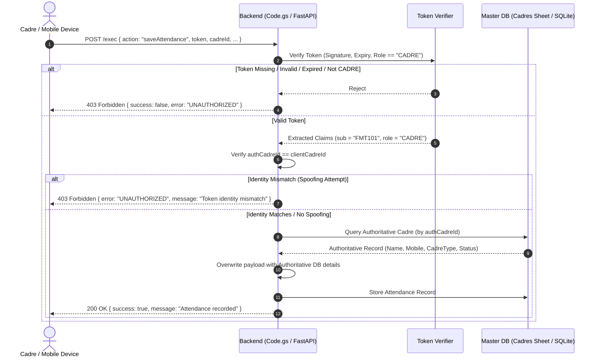

# APCNF Cadre Attendance & Feedback App v2
## P0-01: Strict Cadre API Authentication & Identity Binding Guide

---

### 1. Executive Summary

In previous iterations of the application, cadre endpoints (`saveAttendance`, `saveFeedback`, and `getDashboard`) were vulnerable to unauthenticated submissions and identity spoofing:
- Requests could omit the authentication token entirely and still be processed.
- A user could provide an arbitrary `cadreId`, `name`, `mobile`, or `cadreType` in the payload, allowing potential identity impersonation.
- The Cadre Dashboard (`getDashboard`) did not verify caller authorization tokens.

The **P0-01 Security Patch** enforces **Strict Cadre API Authentication and Server-Side Identity Binding** across the Google Apps Script backend (`Code.gs`), the native Android app networking layer (`ApiService.kt`), and local/cloud servers (`main.py`, `server.py`).

---

### 2. Architecture & Security Flow



---

### 3. Core Security Rules Enforced

| Rule # | Security Policy | Implementation Details |
|---|---|---|
| **Rule 1** | **Mandatory Authentication** | `saveAttendance`, `saveFeedback`, and `getDashboard` strictly require `payload.token`. Requests missing tokens are rejected immediately. |
| **Rule 2** | **Role Separation (`CADRE`)** | Tokens must be verified using HMAC-SHA256 signature and must possess `role: "CADRE"`. Admin tokens or forged tokens are rejected with `UNAUTHORIZED`. |
| **Rule 3** | **Identity Binding** | The authenticated user ID (`authCadreId`) is extracted directly from the verified token claim (`sub`). Client-provided `name`, `mobile`, and `cadreType` are discarded and overwritten with authoritative data from the database. |
| **Rule 4** | **Mismatch Defense** | If a client explicitly passes a `cadreId` that does NOT match the token's authenticated ID, the server rejects the request with HTTP 403 (`UNAUTHORIZED`). |
| **Rule 5** | **Strict Dashboard Scoping** | `getDashboard` only computes and returns metrics for the identity extracted from the verified token. |
| **Rule 6** | **Fast-Fail on Android App** | `ApiService.kt` checks that `token` is non-null and non-blank before making network requests, preventing unauthenticated network calls. |

---

### 4. Changed Files Summary

#### 1. `Code.gs` (Google Apps Script Backend)
- **`saveAttendance`**: Checks `payload.token`, calls `verifyToken_(payload.token, CONFIG.ROLES.CADRE)`, enforces `authCadreId === clientCadreId`, retrieves active cadre via `getCadreById_(authCadreId)`, and binds authoritative profile values.
- **`saveFeedback`**: Enforces the same strict token authentication and identity binding.
- **`getDashboard`**: Requires a valid CADRE token, verifies identity match, and scopes metrics strictly to `authCadreId`.
- **`getCadreById_()`**: Added helper to look up a cadre strictly by verified `cadreId`.
- **Standardized Error Responses**: Aligned catch blocks in `doGet` and `doPost` to return `error: "UNAUTHORIZED"` for security rejections.

#### 2. `ApiService.kt` (`android_app/.../data/api/ApiService.kt`)
- `submitAttendance(request, token)`: Ensures token is present; returns `Result.failure(Exception("Authentication token is required."))` if missing or blank.
- `submitFeedback(request, token)`: Ensures token is present; returns `Result.failure(Exception("Authentication token is required."))` if missing or blank.
- `getDashboard(cadreId, token)`: Strictly passes `token` and checks for non-blank value before dispatching.

#### 3. `main.py` & `server.py` (FastAPI & Local Dev Mock Server)
- Updated `process_action` handlers for `saveAttendance`, `saveFeedback`, and `getDashboard` to verify tokens with role `CADRE`, check for identity tampering, bind authoritative records from the database, and return HTTP 403 with `{ "success": false, "error": "UNAUTHORIZED" }` on violations.
- Added `token` query parameter support on `GET /api/dashboard`.

#### 4. `test_rbac.py` (Automated Security Test Suite)
- Extended the test suite to 10 automated test cases verifying token requirement, tampering rejection, identity mismatch rejection, role cross-calling rejection, and successful authorized flows.

---

### 5. Automated Test Results

To run the RBAC and Cadre Authentication test suite:

```bash
# 1. Start backend server (port 8000)
python main.py

# 2. In another terminal, run test suite
python test_rbac.py
```

#### Test Execution Output:

```text
============================================================
PROJECT APCNF — RBAC STRICT CADRE & ADMIN TEST SUITE
============================================================

[TEST 1] Testing Cadre Login (FMT101 / 9876543210)...
  Result: PASSED (Role: CADRE, HasToken: True)

[TEST 2] Testing Admin Login (admin@apcnf.gov.in / Admin@APCNF2026)...
  Result: PASSED (Role: ADMIN, HasToken: True)

[TEST 3] Testing Authorization Barrier: Cadre attempting to access Admin Dashboard...
  Result: PASSED (Access Correctly Denied)
  Server Message: Access denied. Required role: ADMIN

[TEST 4A] Testing Unauthenticated access to Admin API (No Token)...
  Result (No Token): PASSED (Access Denied)
[TEST 4B] Testing Tampered / Invalid Token on Admin API...
  Result (Fake Token): PASSED (Access Denied)

[TEST 5A] Testing Admin Dashboard with valid Admin Token...
  Result (Admin Dashboard): PASSED (Total Cadres: 3)
[TEST 5B] Testing Admin All-Data API with valid Admin Token...
  Result (Admin All Data): PASSED (Cadres count: 3)

[TEST 6A] Testing Cadre Attendance submission with Valid Cadre Token...
  Result (Attendance): PASSED (Msg: Attendance for 'Field Visit' recorded successfully.)
[TEST 6B] Testing Cadre Feedback submission with Valid Cadre Token...
  Result (Feedback): PASSED (Msg: Feedback submitted successfully.)
[TEST 6C] Testing Cadre Dashboard fetch with Valid Cadre Token...
  Result (Dashboard): PASSED (HasData: True)

[TEST 7A] Testing saveAttendance without token -> DENIED...
  Result (saveAttendance no token): PASSED (Denied)
[TEST 7B] Testing saveFeedback without token -> DENIED...
  Result (saveFeedback no token): PASSED (Denied)
[TEST 7C] Testing getDashboard without token -> DENIED...
  Result (getDashboard no token): PASSED (Denied)

[TEST 8A] Testing saveAttendance with fake token -> DENIED...
  Result (saveAttendance fake token): PASSED (Denied)
[TEST 8B] Testing saveFeedback with fake token -> DENIED...
  Result (saveFeedback fake token): PASSED (Denied)
[TEST 8C] Testing getDashboard with fake token -> DENIED...
  Result (getDashboard fake token): PASSED (Denied)

[TEST 9A] Testing saveAttendance with token for FMT101 but payload cadreId ICRP05 -> DENIED...
  Result (saveAttendance ID mismatch): PASSED (Denied)
[TEST 9B] Testing saveFeedback with token for FMT101 but payload cadreId ICRP05 -> DENIED...
  Result (saveFeedback ID mismatch): PASSED (Denied)
[TEST 9C] Testing getDashboard with token for FMT101 but payload cadreId ICRP05 -> DENIED...
  Result (getDashboard ID mismatch): PASSED (Denied)

[TEST 10A] Testing saveAttendance with ADMIN token -> DENIED...
  Result (saveAttendance with Admin Token): PASSED (Denied)
[TEST 10B] Testing saveFeedback with ADMIN token -> DENIED...
  Result (saveFeedback with Admin Token): PASSED (Denied)
[TEST 10C] Testing getDashboard with ADMIN token -> DENIED...
  Result (getDashboard with Admin Token): PASSED (Denied)

============================================================
RBAC & CADRE AUTHENTICATION TEST SUMMARY
============================================================
  [PASS] 1. Cadre login -> returns CADRE role and token
  [PASS] 2. Admin login -> returns ADMIN role and token
  [PASS] 3. Cadre token CANNOT access Admin Dashboard API
  [PASS] 4. Unauthenticated / forged token CANNOT access Admin APIs
  [PASS] 5. Admin CAN access authorized Admin APIs
  [PASS] 6. Valid CADRE token -> ALLOWED on Cadre endpoints
  [PASS] 7. No-token Cadre requests -> DENIED
  [PASS] 8. Fake/invalid token on Cadre requests -> DENIED
  [PASS] 9. Valid CADRE token + different cadreId -> DENIED
  [PASS] 10. Valid ADMIN token calling Cadre-only endpoint -> DENIED
============================================================
OVERALL RESULT: 10/10 TESTS PASSED
```

Additionally, running the Admin Phase 2 suite:
```bash
python test_phase2_admin.py
```
Passes **14/14 tests**, confirming 100% backward compatibility and zero regressions on the Admin reporting and filtering flows.

---

### 6. Preservation of Existing Features

1. **Native Offline Sync Queue**: In `DashboardFragment.kt`, when pending offline submissions are synced upon network restoration, the session token stored in `SessionManager` is attached automatically.
2. **Attendance & Feedback Business Validation**: Existing field checks (date normalization, GPS coordinate requirements, photo processing, star rating ranges) remain completely intact.
3. **Database Schema & Google Sheets**: No columns, headers, or schema definitions were altered.
4. **Admin Oversight**: Administrators continue to authenticate and manage data using their dedicated server endpoints.
